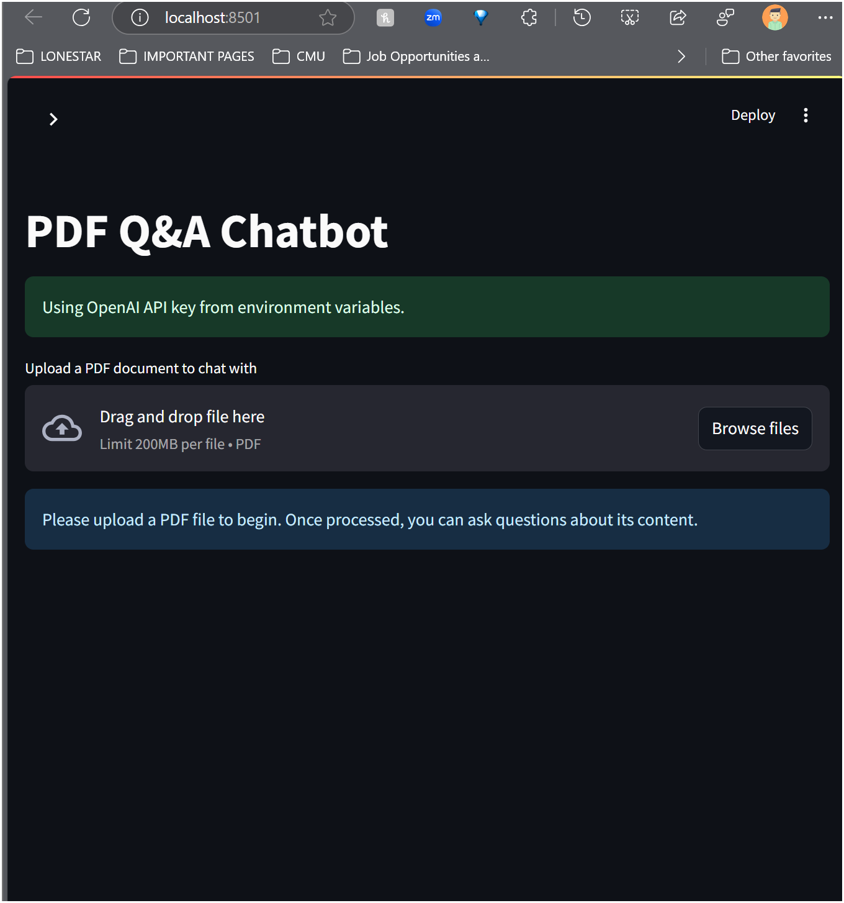
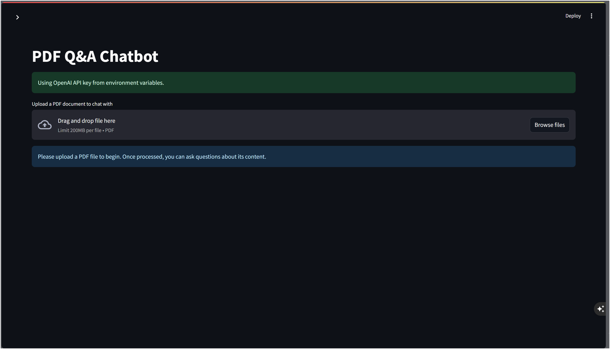
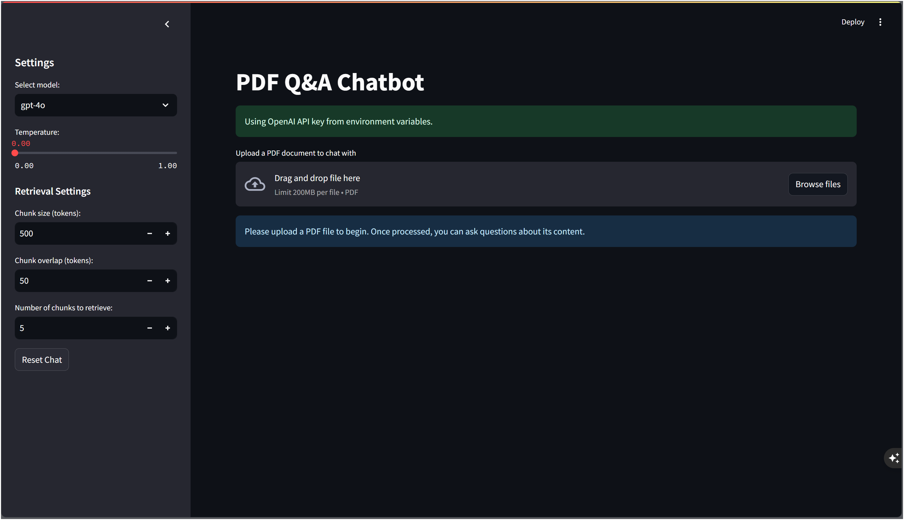
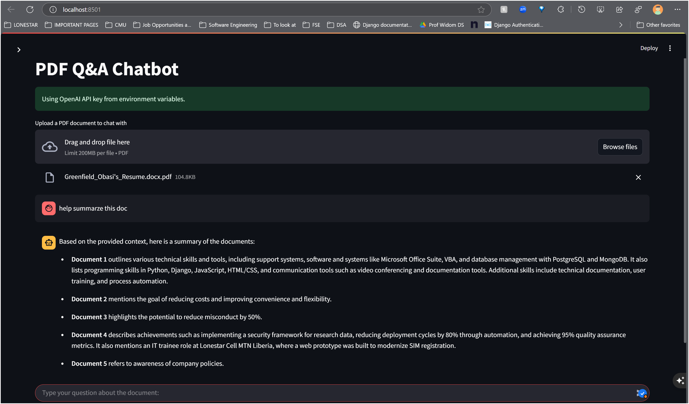
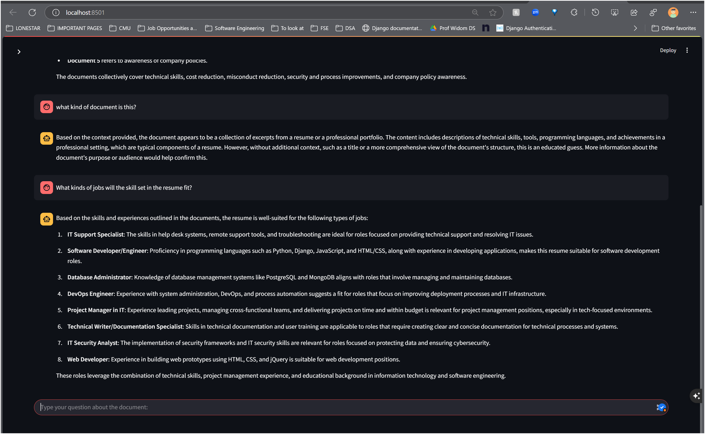

# GREENFIELD'S PDF Q&A Chatbot

A Streamlit application that allows users to upload PDF documents and ask questions about their content using OpenAI's language models and vector embeddings.

![GREENFIELD'S PDF Q&A Chatbot Demo]

## Purpose

This project was created for personal use and experimentation with various AI and data processing technologies. It serves as a practical exploration of:

- Retrieval-Augmented Generation (RAG) techniques
- Vector embeddings and similarity search
- Integration of LLMs with document processing
- Building interactive web applications with Streamlit
- Working with the OpenAI API ecosystem

The application demonstrates how these technologies can be combined to create a useful tool for extracting information from PDF documents through natural language queries.

## Features

- Upload and process any PDF document
- Ask questions in natural language about the document content
- Adjustable retrieval settings for fine-tuning response quality
- Model selection (GPT-4o, GPT-3.5-Turbo)
- Configurable response temperature
- Conversation history with reset option
- Responsive design that works on desktop and mobile

## Technologies Used

### Core Components:
- **Streamlit**: Chosen for its simplicity and rapid development capabilities for data apps
- **LangChain**: Used for creating chains of operations for document processing and retrieval
- **OpenAI API**: Provides the language models (GPT-4o, GPT-3.5-Turbo) and embeddings
- **ChromaDB**: Vector database for storing and retrieving document chunks

### Why These Technologies?

- **Streamlit**: Enables quick development of interactive web applications with minimal code. It's perfect for data-focused applications and prototypes.
- **LangChain**: Provides a comprehensive framework for building LLM applications, including document loaders, text splitters, and vectorization tools.
- **OpenAI API**: Offers state-of-the-art language models for high-quality responses and powerful embeddings for semantic search.
- **ChromaDB**: A lightweight, open-source vector database that works well for smaller applications and doesn't require complex setup.

## Installation and Setup

### Prerequisites
- Python 3.8 or higher
- OpenAI API key

### Installation Steps

1. Clone the repository:
   ```bash
   git clone https://github.com/GreenfieldO/PDF-QA-CHATBOT.git
   cd pdf-qa-chatbot
   ```

2. Create and activate a virtual environment:
   ```bash
   python -m venv venv
   source venv/bin/activate  # On Windows: venv\Scripts\activate
   ```

3. Install required packages:
   ```bash
   pip install -r requirements.txt
   ```

4. Create a `.env` file in the project root and add your OpenAI API key:
   ```
   OPENAI_API_KEY=your_api_key_here
   ```

5. Run the application:
   ```bash
   streamlit run app.py
   ```

6. Open your browser and go to `http://localhost:8501`

## Usage

1. Enter your OpenAI API key if not provided via environment variables
2. Upload a PDF document using the file uploader
3. Wait for the processing to complete
4. Ask questions about the document content using the chat input
5. Adjust settings in the sidebar to improve response quality if needed

## Settings Explanation

- **Model**: Select between GPT-4o (higher quality, slower) and GPT-3.5-Turbo (faster, lower cost)
- **Temperature**: Controls randomness in responses (0.0 = deterministic, 1.0 = creative)
- **Chunk size**: Size of document segments for processing (larger = more context)
- **Chunk overlap**: How much text overlaps between chunks (higher = better continuity)
- **Number of chunks**: How many segments to retrieve for each query (more = comprehensive answers)

## Screenshots

### Main Interface


### Settings Panel


### Chat Example



## Future Improvements

1. **Multiple Document Support**: Allow uploading and querying across multiple PDFs simultaneously
2. **Document Preprocessing Options**: Add options for OCR, table extraction, and image analysis
3. **Local Models Integration**: Experiment with open-source models like Llama 3 or Mistral
4. **Export Functionality**: Allow exporting of Q&A sessions to PDF or Markdown
5. **Alternative Embedding Models**: Test different embedding models and compare performance
6. **Advanced Visualization**: Implement document maps and relevance highlighting
7. **Memory Management**: Implement conversation memory to maintain context across questions
8. **Performance Testing**: Benchmark different chunking strategies and retrieval methods
9. **UI Customization**: Add theme options and layout configurations
10. **Alternative Vector Databases**: Compare ChromaDB with other options like FAISS or Pinecone

## License

This project is licensed under the MIT License - see the LICENSE file for details.

## Acknowledgments

- OpenAI for providing the language models and embeddings
- Streamlit team for the excellent framework
- LangChain community for the comprehensive tools and documentation